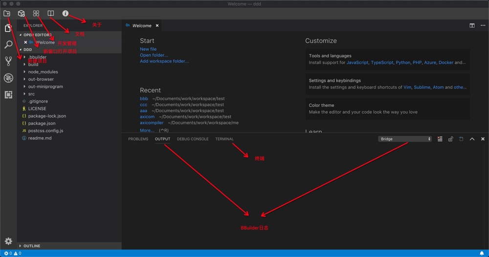

# 开始使用


## 第一步：环境安装

1. 获取BBuilder安装包并安装。

2. 安装依赖程序：nodejs

安装后IDE的结构如下：




## 第二步：新建应用

点击<code>新建应用</code>菜单，在弹出面板中输入<code>项目名称</code>和<code>工作空间</code>，点击确定即可完成应用的创建。


## 第三步：安装依赖

可以使用<code>ctrl + ~</code>快捷键打开终端面板，在终端中如下指令完成安装

```bash

npm install

```

也可以点击<code>开发管理</code>菜单，在弹出面板的<code>启动本地服务</code>中选择<code>安装</code>，点击确定即可完成安装。

日志位于与终端同分类的tab中<code>output面板-bridge分类</code>。下面涉及启动本地服务的，日志均在此处查看。


## 第三步：启动服务

### H5：

编译命令：<code>npm run watch browser</code>

启动web服务：<code>npm run browser default</code>，启动后访问:http://localhost:8000 可以查看页面。其中default可以换成wx，则页面必须在微信中访问，如果仅执行<code>npm run browser</code>，则同时在浏览器和微信中均可访问。 

也可以点击<code>开发管理</code>菜单，在弹出面板的<code>启动本地服务</code>中选择<code>浏览器</code>，点击确定即可完成编译和web服务启动。

### 微信小程序

编译命令：<code>npm run watch miniprogram</code>启动页面监听，然后使用微信官方的开发工具打开out-miniprogram目录。

也可以点击<code>开发管理</code>菜单，在弹出面板的<code>启动本地服务</code>中选择<code>小程序</code>，点击确定即可完成微信小程序的编译。

### 钉钉小程序

编译命令：<code>npm run watch aliapp</code>启动页面监听，然后使用阿里官方的开发工具IDE打开out-aliapp目录（该IDE内部可切换钉钉和支付宝小程序环境）。

也可以点击<code>开发管理</code>菜单，在弹出面板的<code>启动本地服务</code>中选择<code>钉钉/支付宝</code>，点击确定即可完成阿里小程序的编译。